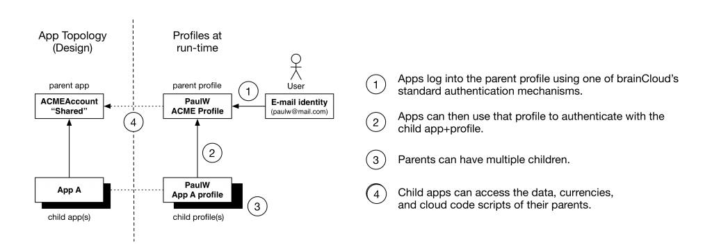
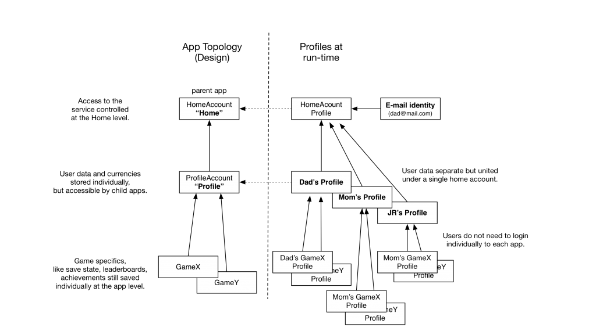
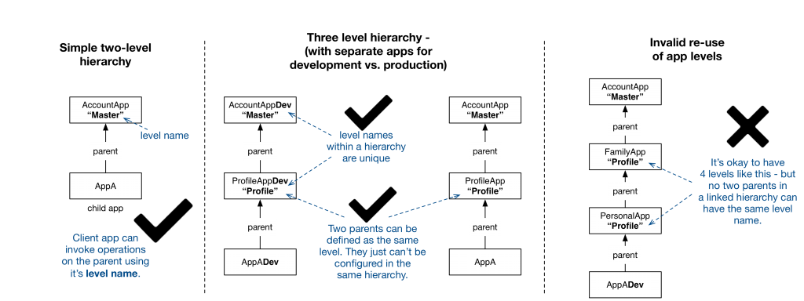

### Overview

The _Shared Accounts_ feature is a powerful example of the flexibility of brainCloud’s authentication architecture.   brainCloud already provides a myriad of authentication options: anonymous, e-mail address, Facebook id, Google Id, GameCenter, Twitter, etc.  brainCloud can even authenticate users with external directories via our External Authentication feature.   _Shared Accounts_ takes this one step further, allowing you to create a single, shared account system for your users to access all (or select) company apps. You will then have a single repository of your users, regardless of the specific app they are using. This is useful to offer common, shared features across all apps - like shared premium currencies, meta-level leaderboards and achievements, etc. - really anything you want.  

### **Parent and Child Accounts**

brainCloud _Shared Accounts_ architecture organizes apps (and their associated profiles) into a hierarchy of parents and children.  Every app can have at most one parent. And parents can have parents as well, so you aren’t limited to a two-level hierarchy.  [Technically we limit you to 5 levels - which should be more than enough - it is enforced primarily to ensure that we don’t get recursion errors at runtime.]  

### **Family Member Profiles**

The shared accounts architecture can also be used to associate multiple personal accounts with a single master account. Consider a Netflix-like game service example, where a single account provides access to a service, but we want to provide for personalized family member profiles within the context of the master account, and then of course separate save data for each app/game that the family member accesses.   Such a topology might look like this:

### **Parent Roles**

To allow for flexible referencing of parent apps from our APIs and data structures, parents must declare a logical “parent level name”.  This level name will be used in API calls and in the underlying meta-data to refer to the parent app. To support separation of apps during development and production, multiple apps may share the same “level name” - but they may not be configured together in the same app hierarchy.

 

### **Authenticating Users**

To authenticate a user in a Shared Accounts scenario, the app must:

- Step 1 - First authenticate the user at the top-level of the hierarchy using one of our standard [Authentication](/api/capi/authentication) calls.  For example, AuthenticateEmailPassword(), etc.
- Step 2 - Switch to a child profile using either the [SwitchToChildProfile()](/api/capi/identity/switchtochildprofile) or [SwitchToSingletonChildProfile()](/api/capi/identity/switchtosingletonchildprofile) methods of the identity service.  The currently authenticated top-level profile will be used as the identity for the sub-profile. As is standard for brainCloud authentication, if the profile doesn’t exist it will be created (if the bForceCreate flag is true)
- Step 3 - Repeat step 2 for as many levels down the hierarchy that you need to use to get to the desired app profile.

  Note, in some scenarios, there may be multiple child-level profiles for a parent profile.  (See the "Family Member Profiles” scenario above).  For those situations, you can call a [GetChildProfiles()](/api/capi/identity/getchildprofiles) method to receive a list of candidate profiles to switch to.    

### **API calls and switching levels**

Once you’ve authenticated users at the final app level, you’re ready to go.  All calls at this level behave the same way as they do for any other brainCloud app.  _Note that for analytics and billing purposes, brainCloud records API counts across each app id separately._   Should you want to switch context back to that of a parent profile, you can do so using the [SwitchToParentProfile()](/api/capi/identity/switchtoparentprofile) API call.  From then on, all API calls will be processed at the parent level specified.   For example:  Once you’ve fully authenticated, if you call GetPlayerState(), this operation will act upon the currently active child profile.  If you’d like to get that same information about the parent profile, you could call SwitchToParentProfile() first, then GetPlayerState(), and then return back to the child level via SwitchToChildProfile().   _Although this is workable, it’s far from elegant for making quick calls at a parent profile level - which is why we allow you to call parent cloud code scripts (see next section)._

### **Calling Parent Scripts**

Often the child app will need to access or manipulate data that’s stored at the parent profile level. This can be easily accomplished via Cloud Code.   brainCloud now supports a new [RunParentScript()](/api/capi/script/runparentscript) API call that allows child apps to run scripts that are both defined at the parent app level, and operate on the profile data at that level.   So, for example, if you wanted to log the number of game rounds played across all child apps, you could write a Cloud Code script called IncrementGamePlayed() at the parent level, and call it when appropriate from any of its child apps.   The syntax is RunParentScript( `script_name`, `parameters`, `parent_level` ), where

- `script_name` is the name to run
- `parameters` is the json data that you'd like to pass to the script
- `app_level` is the the parent level that the script is defined (and will be run) at

  Note that brainCloud will automatically adjust the server context to make the appropriate parent profile (as identified by the &lt;app_level&gt; current before running the script), and return it to prior app level when the script is complete.    

### **Special case: Working with currencies**

The brainCloud API’s are generally designed to access data associated with the currently select app id and profile. If you want to access data for another level, you must either switch the current profile level, or call RunParentScript().   Currencies are an exception to this. It is very common for child apps to want to access and manage the currency balances shared in the parent profiles.  Furthermore, for in-app-purchases are normally defined at the child app level, but may allocate shared currencies defined in parent apps.   To facilitate these use cases, we have expanded the brainCloud APIs to allow largely transparent access to parent currencies.

  The following new API calls have been added:

- [AwardParentCurrency()](/api/capi/product/awardparentcurrency) - allows you to increment the currency balance of the specified parent-level currency
- [ConsumeParentCurrency()](/api/capi/product/consumeparentcurrency) - allows you to decrement the balance of the specified parent-level currency
- [GetParentCurrency()](/api/capi/product/getparentcurrency) - retrieves the current balance of the specified parent-level currency (note: also returned in Authentication and Player State )
- [ResetParentCurrency()](/api/capi/product/resetparentcurrency) - resets all currency balances at the specified parent-level (mostly useful for testing / debugging)
