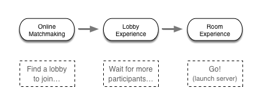
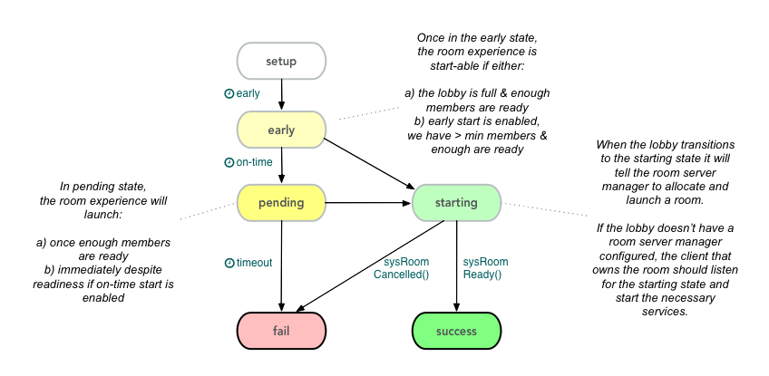

## Background

The addition of _Real-Time Tech_ to brainCloud brings with it many features, including _Lobbies_.

A _lobby_ is used to gather up participants in preparation for a _multi-user experience_, which we call a _room experience_. Lobbies are essential for online games but are also valuable for non-gaming applications like online meetings, desktop sharing, etc. The process of randomly selecting a group of suitable participants for a lobby is referred to as _matchmaking_.

Some important things to understand about lobbies:

- lobby participants are called _members_
- the _member_ that created the lobby is also called the _owner_
- _members_ are organized into _teams_. All lobbies must have _at least_ _one_ team.
- teams specify a _minimum_ and _a maximum_ number of members. Room experiences cannot be started until the minimums are satisfied
- members indicate when they are _ready_ to proceed to the room experience
- progression rules are configured by _lobby type_ in the Design Portal. Every lobby is an instance of a _lobby type_

## Online Matchmaking

The _Lobby Service_ provides an _Online Matchmaking API_ - not to be confused with the _Offline Matchmaking API_ supplied by the _Matchmaking Service_.

Offline Matchmaking, as you would expect, is suitable for offline experiences - like async turn-by-turn games (Words with Friends, etc.) and one-way offline multiplayer (i.e. Clash-style games). In these games, you don't care whether the matched user is online or not.

Online matchmaking is very different - you need all players to be online and concurrently looking for a match.

The following features are supported:

- basic filtering by _lobby type_ and user _skill rating_
- automated expansion of skill rating _range_
- custom matchmaking filters (via cloud code scripts)
- automatic creation of lobbies if no eligible ones are found

## Lobby Experience

Once in a lobby, brainCloud prepares the users for the _room experience_ according to the rules configured for the lobby type in the Design Portal.

The lobby lifecycle involves the following states:

- **setup** - the initial state upon creation. New members can join, but it is too early for the experience to start.
- **early** - once the _earliest start_ time is past, the lobby enters the _early_ state - and the room experience is partially start-able. In this state, the room experience will launch if:
    - the lobby teams are all _full_ and enough members are ready; or...
    - _allow early start without max participates_ option is enabled, the teams satisfy the _minimum_ participation requirements, and enough members are ready
- **pending** - once the _on-time start_ time is past, the lobby enters the _pending_ state. Ideally, the room experience is _supposed_ to start at this time. Indeed, it _will_ start if and when:
    - the lobby teams meet the _minimum_ size requirements, and enough members are ready
    - if the _force on-time start without ready_ option is enabled, the lobby will skip the ready-check, and simply start if the minimum team members are available
- **starting** - in this state, the room experience has been asked to launch, and the lobby is just waiting on confirmation that a room service has been _allocated_, and is _ready_. If a _room server manager_ is configured in the design portal, the launch endpoint will be called to allocate a room server. If a peer-to-peer experience is being used instead, the owner client should listen for the lobby to enter the _starting_ state to begin preparing the room experience
- **success** - the lobby will move to the _success_ state once the room service provides calls back with the `sysRoomReady()` API call. At that point, all lobby members will be sent the `ROOM_READY` event, and should respond by connecting to the room experience. Immediately after participants will receive the `DISBANDED` event as the lobby is destroyed.
- **fail** - the lobby moves to the **fail** state if the lobby _too late start_ time is past. It also fails is the room service sends in `sysRoomCancelled()`.

The full set of Lobby methods and events can be found in the [Lobby Service](/api/capi/lobby "Lobby Service") API documentation.

## Room Experience

The Room Experience is completely up to the room server developer.

brainCloud supports two architectural strategies for room services:

- **custom room servers** - brainCloud customers can write their own room servers that work with our lobby services. These services should be managed by a room server manager that brainCloud calls to launch new room servers. _brainCloud does not currently host/manage 3rd party room servers. We plan to expand our offering in the near future to offer a built-in Room Server Manager with the ability to launch custom Docker-based Room Services._
- **peer-to-peer** - alternatively, room experiences can be provided in a peer-to-peer manner by a member of the lobby (typically the owner). In this case, the lobby member should wait for the lobby to enter the "starting" state to launch the experience.

Important things to understand about Room Experiences:

- Room Experiences are given all lobby data upon start. Thus they have access to the list of members, team allotments, the static lobby config, and dynamic lobby settings data.
    - Room Server Managers receive this data when brainCloud calls the <rsm-url\>/<rsm-endpoint\>/assign-room.
    - Peer-provided services have access to the data via the `lobby` data present in the
- Room Experiences should validate participants as they join. Have them provide their profile ids and sessionIds and check them against the member data provided
- Be advised that the lobby is destroyed once the `ROOM_READY` event has been sent to the participants
- The technologies and protocols used for room experiences are completely up to the developers
- Room Experiences can communicate with the brainCloud API via the S2S interface. Be sure to configure the servers via the Design | Cloud Code | S2S Config page, and provide an IP range to restrict access to the API to just the hosted servers.
- Peer-to-peer Room Experiences should use _not_ use the S2S API (since you can't restrict the IPs of clients). They should continue to use the standard Client API instead.
