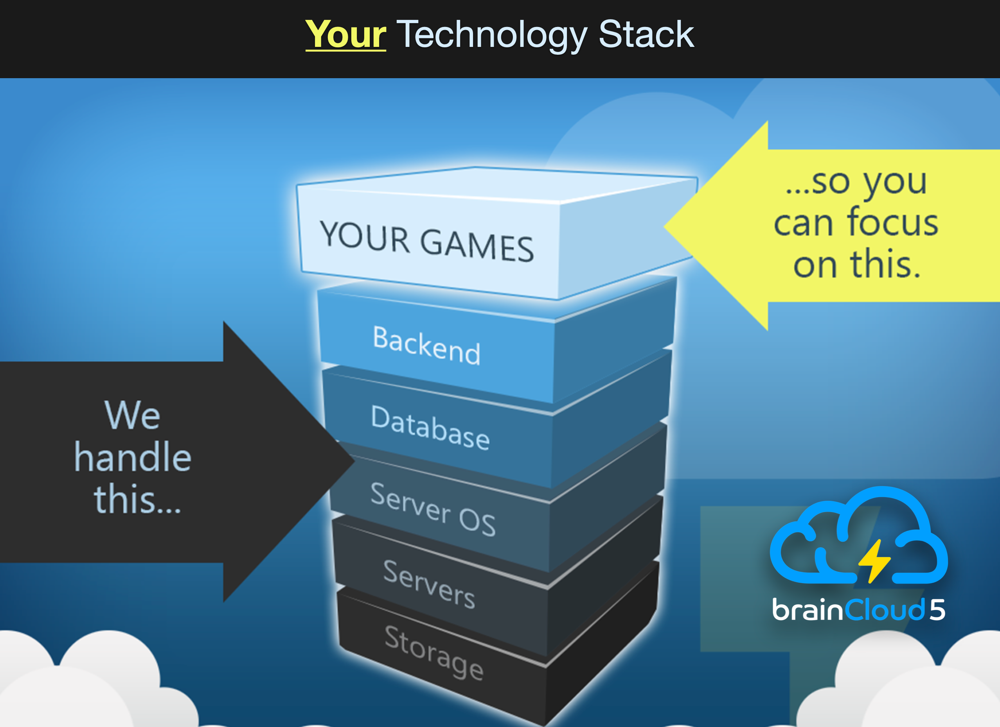

## Welcome👋

Welcome to the [brainCloud BaaS](http://getbraincloud.com) documentation.  Here you will find the latest details on developing with brainCloud - including feature overviews, how-to's, [API references](/learn/api-reference/) and [video tutorials](https://bootcamp.braincloudservers.com).

brainCloud has a very broad feature-set, you can use as much or as little of it as you like!

The brainCloud Docs are organized as follows:

- [**Introduction**](/learn/introduction/) - introduces the key concepts that are important to understanding the workings and organization of the APIs
- [**Key Concepts**](/learn/key-concepts/) - key concepts that programmers will need to understand
- [**API Reference**](/api/introduction) - usage details for the API methods themselves **&lt;- KEY DOC!**
- [**Client Libraries**](/learn/client-libraries/) - links to the client libs
- [**Cloud Code Central**](/learn/cloud-code-central/) - cloud code tips and examples
- [**Portal Tutorials**](/learn/portal-tutorials/) - how to use the Design Portal
- [**SDK Tutorials**](/learn/sdk-tutorials/) - tutorials on various aspects of the API
- [**Support**](/learn/support/) - answers to frequently asked questions
- [**Release History**](https://updates.braincloudservers.com) - view the latest platform updates

_We are continuously improving our documentation - so be sure to check back often.  And if you can't find what you're looking for - don't hesitate to reach out by clicking the green **Help** widget on any of our pages._

_Speaking of improvements..._ Be sure to check out our **[Bootcamp Video Tutorials](https://bootcamp.braincloudservers.com)**.  Full video training courses for Unity, Unreal and Godot!  And they are completely free!

To get started, all you need to do is:

- [Register](https://portalx.braincloudservers.com/?signup=true "Register") - it's free! \*
- [Download](/learn/client-libraries/ "Download Client Libs") your preferred SDK
- Pick a [Bootcamp Tutorial](https://bootcamp.braincloudservers.com)
- Get coding! Good luck!

\* Free during development, and super reasonably priced thereafter.  Details on our [pricing](http://getbraincloud.com/pricing-overview/) page.
